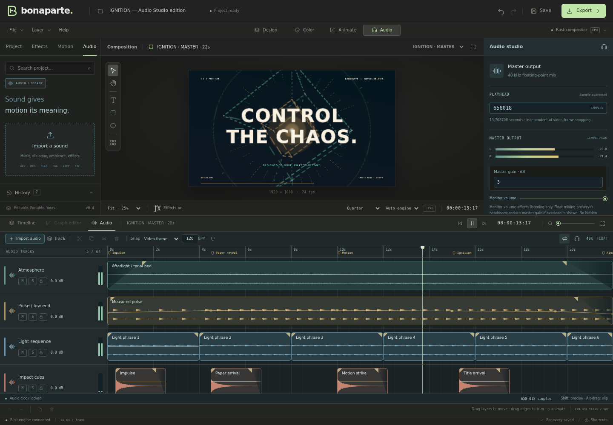
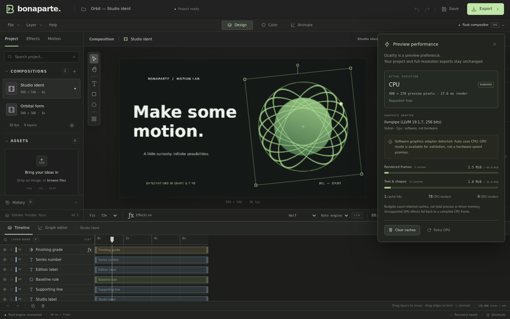

# Bonaparte Studio

**An editable motion-graphics foundation, built with Svelte 5, Tauri 2 and Rust.**

**v0.5.1 is an editing-stability patch.** It fixes input fields that waited for blur, rotation/scale pivot errors, stale visibility toggles and transform proxies, fixed-density text/vector/precomp scaling, and timeline range/navigation problems. Feature expansion is paused while these real editing cases are tested. [Bug ledger and verification scope](docs/STABILITY-0.5.1.md).


## Run the editor

Prerequisites: current stable **Rust**, **Node.js 20.19+ or 22.12+**, and npm. Install **FFmpeg and ffprobe on PATH** for MP4 export and media tests. PNG export does not require FFmpeg.

### Browser workspace, with the real Rust compositor

From this checkout, or after extracting the source archive:

```sh
cd bonaparte/ui
npm ci
npm run studio
```

These changes are based on [samarnever-droid/bonaparte](https://github.com/samarnever-droid/bonaparte). They are local changes in this deliverable, not a claim that the upstream repository has already been updated.

Open **http://localhost:5173**. `studio` builds and starts the Rust development service on port 4317, then Vite on port 5173. There is **no mock document service or JavaScript compositor**. The browser displays RGBA frames from the same Rust runtime used by Tauri.

For custom ports, set `BONAPARTE_API_PORT` and `VITE_PORT`. The `/api` proxy is same-origin; client code does not call a browser's `localhost` backend. The service binds to `0.0.0.0` for sandbox previews. It is **single-session, development-only, without authentication**: do not expose it to an untrusted network or use it as a multi-user deployment.

The current stability build is served as one **Bonaparte Studio · Stability fixes** preview on port **5173** in this workspace. Previously saved project copies are retained; there is no requirement to guess between multiple milestone ports.

### Native desktop

Install the [Tauri 2 platform prerequisites](https://v2.tauri.app/start/prerequisites/), then:

```sh
cd ui
npm ci
npm run tauri dev
```

The native app invokes Rust directly and does not need the HTTP service. Native project/image/video exports use a save dialog and atomic destination replacement. Native build compilation is checked; signed installers, auto-update and cross-platform desktop interaction testing are not part of this milestone. Bundling remains disabled in the Tauri configuration.

## What works

| Area | Implemented in this milestone |
|---|---|
| Projects | New/open/save, versioned portable JSON, embedded image assets, local IndexedDB recovery, invalid-file rejection |
| Compositions | Multiple/nested compositions, editable name, dimensions, background/alpha, rational frame rate and duration |
| Content | Live text/number/color editing with grouped undo; bundled regular/bold DejaVu Sans, size/tracking/color; rectangle/rounded rectangle and ellipse size/fill/stroke; solids; still-image layers; adjustment layers |
| Canvas | Native CPU/GPU preview; anchor-aware move/scale/rotate controls; continuous text/generator/precomp rasterization; fit/zoom/pan, guides and effect bypass |
| Performance | RAF-coalesced gestures, cached interaction planes, incremental edit replies, immutable project mirror, worker image import, adaptive draft grids and bounded caches |
| Timeline | Stable visibility/lock toggles, selection/order/duplicate/delete; editable duration, +10s extension, resettable view range, trim/retime and best-effort playback |
| Animation | Position, scale, rotation, opacity and anchor tracks; keyframe add/remove/move; normalized outgoing Bézier easing editor; four editable motion recipes |
| Effects | Ordered, enabled/disabled, undoable effect instances; manifest-driven controls; scalar/point parameter keyframes |
| Color | 12-control Color Grade, adjustment-layer grading, gradient ramp, sampled 64-bin rendered-frame RGB histogram |
| Audio | Mono/stereo import, sample-addressed clips, automation/fades, audio-clocked playback, parametric EQ, stereo compression, compensated limiter, mix buses and post-strip sends |
| Output | PNG with alpha; H.264 MP4 with the native 48 kHz stereo AAC mix; 32-bit float WAV; snapshot-based exports |
| Automation | Stdio MCP project/Op/history/render tools; effect catalog; shared persistence, validation and rendering behavior |

### Color and effect pipeline

**Color Grade:** temperature, tint, exposure, contrast, highlights, shadows, whites, blacks, saturation, vibrance, gamma and fade. Neutral settings are byte-identical; alpha is retained. Exposure and relative white balance operate in linear light; tonal/color controls operate on display-referred RGB. This is **8-bit sRGB**, not HDR, ACES, calibrated Kelvin white balance or a LUT pipeline.

13 first-party packs are registered: **Color Grade, Gradient Ramp, Color Adjust, Tint, Invert, Vignette, Gaussian Blur, Directional Blur, Glow, Drop Shadow, Chromatic Aberration, Transform and Circle**. Circle is a generator; the library shows the 12 filters. Shape content colors are linear model values, converted by the inspector; effect color parameters use display sRGB.

Normal layers render their transformed source into composition space, run the ordered stack, then apply effective opacity and blend. An adjustment layer processes the accumulated backdrop below it and mixes by its opacity; its transform and blend mode do not act as a mask. Blur/glow/shadow are alpha-aware. Spatial effects operate in composition space and clip to the composition bounds.

Plugin metadata and defaults live in manifests. The native GPU host executes 9 filters (plus the Circle program) and uses reflected WGSL uniform layouts. **Gaussian Blur, Glow and Drop Shadow currently trigger whole-frame CPU fallback.** Tests exercise real GPU submission/readback and a plugin unknown to the engine. There is no GUI shader-installation manager, and unregistered/unsupported programs are not silently substituted. See [rendering details](docs/RENDERING.md) for coverage, tolerances, budgets and extension contracts.

## Audio Studio

Open the **Audio** workspace. Import sound from the library/toolbar or drop a WAV, MP3, FLAC, OGG, AIFF, M4A or AAC file. Clips remain non-destructive; exact sample offsets and gain/pan automation are available in the audio inspector. Track mute/solo, master controls, loop playback and scrub audition are integrated.

Playback and export use **one Rust mixer**. The AudioWorklet consumes mixed PCM and drives the timeline clock. Clip positions use 48 kHz sample frames rather than being rounded to video frames. The working rate is 48 kHz float, with original encoded sources retained in the portable project.

The audio-enabled IGNITION demonstration uses five tracks and fifteen clips; the included example now also demonstrates channel strips and Music/Effects buses. Its native MP4 has 528 video frames and synchronized 48 kHz stereo AAC over 22.000 seconds. See [Audio Studio details](docs/AUDIO.md) for source limits (inline up to 16 MiB, Astra-backed beyond that, 2 GiB per source) and the 256 MiB embedded-media budget, cache policy, tests and deferred DAW features.



## Responsive gestures and mix processing

Movement in Auto quality can use a marked cached interaction preview. Scaling/rotation use fresh native frames; Full quality is honored throughout. Text, generated shapes and enlarged child compositions re-rasterize at the required density within resource bounds. This avoids waiting for every full render. Complex blend/adjustment effects may settle differently after the drag; this is not an exact second compositor. In an isolated 487-layer-project check, commit replies fell from about 1.77 MB to under 1 KB and observed commit confirmation from 782 ms to about 52–148 ms. These are local measurements, not a universal latency promise.

Select an audio track, bus, or master to use **native EQ and stereo compression**. The master can enable a latency-compensated, 5 ms lookahead **sample-peak limiter**. Add named buses from the Audio toolbar/library and route main outputs or post-strip sends. Processing edits are undoable; feedback cycles are rejected. Checkpoints and compensated routing keep processed seeks and exports consistent.

See [v0.5 details](docs/RESPONSIVENESS-AND-DSP.md) for signal flow, resource limits, proxy accuracy and staged DSP preparation.

## Faster previews

Use **Preview resolution** and **Preview renderer** in the viewer footer. Auto quality uses full resolution while paused and half during playback. Click **Rust compositor** to see actual execution, the detected adapter, cache usage and fallback reasons. Preferences do not modify the project; **PNG/MP4 exports stay full resolution on the CPU reference path**.

Auto selects a compatible hardware GPU for supported scenes; otherwise it uses CPU. Explicit GPU mode can run through a software Vulkan driver and is labeled **GPU · software**, not hardware acceleration. Device/unsupported-effect failures return complete CPU frames with a reason.

In the two-vCPU verification sandbox, the isolated Orbit sample measured **102.37 ms** on the original full-resolution CPU path, **83.02 ms** on the prepared full-resolution CPU path, **22.94 ms** at half and **6.80 ms** at quarter. Reduced grids trade detail for speed. Timings exclude network/browser painting and are not hardware or real-time guarantees. [Raw samples and reproducible benchmark](docs/RENDERING.md#reproduce-the-performance-sample).



## Try the workflow

1. Start with the editable **Orbit studio ident**, or **File → New project → Blank project**.
2. Add a text or shape layer; edit its content in **Properties**. Import a PNG/JPEG/WebP through **Project** or drag-and-drop.
3. Add **Color Grade** in the effects library. Use an **Adjustment layer** to grade everything underneath. Switch to **Color** for the histogram; use the viewer's bypass button for comparison.
4. Move the playhead, add inspector diamonds, or apply a **Motion** recipe. Expand a timeline layer to move keys. The graph edits **normalized easing of one outgoing segment**, not an AE-style value/speed graph.
5. **Save** an editable `.bonaparte` file. Recovery is a convenience, not a backup. Use **Export** for a PNG of the current frame or an MP4 of the full active composition.

`Space` plays/pauses; arrows step frames; `Shift`+arrows step ten. `V`/`H`/`R` select/hand/rotate; `G` guides; `K` keyframe; `1`/`2`/`3` switch workspaces. `Ctrl`/`Cmd`+`S`, `O`, `D`, `Z`, `Shift+Z` save/open/duplicate/undo/redo. **Help** lists shortcuts.

## Limits worth knowing

- Preview is **not guaranteed real-time**. Playback follows composition time and coalesces render requests; it can skip preview frames. MP4 export renders every scheduled frame.
- GPU preview is hybrid: text/generator rasterization remains CPU-side. GPU exports, separable GPU blur/glow/shadow and in-flight cancellation are not implemented.
- Frame/source/texture caches have explicit retention limits, not an overall RAM/VRAM guarantee; see [cache policy](docs/RENDERING.md#cache-and-memory-policy).
- Effects currently use **full-frame intermediates**. Effect-bearing tile requests render then crop, not bounded-ROI processing. The old “8 GB / flat RAM / O(tile)” end-to-end promises do not apply.
- New blank projects start at 30 seconds. Duration is editable and can grow; there is no five-second limit, but the validated duration ceiling remains 24 hours.
- Adaptive vector/text/precomp rasterization is bounded to 8× density, 16MP individual rasters and 64MP prepared composition intermediates. A low-resolution imported image cannot acquire missing detail.
- Compositions: up to 8192 px per axis, **16,777,216 pixels**, exact-tick frame rates between 1 and 240 fps, duration up to 24 h. These are validation ceilings, not performance guarantees.
- Image import: PNG/JPEG/WebP; source file up to 64 MB, reduced to a 4096 px longest edge for the working asset. Embedded model images are at most 16,777,216 pixels (the full comp ceiling); encoded assets share a 256 MiB document budget. Original full-resolution sources are not separately retained.
- Project files: at most 512 MiB. Version 4 files, versions 2/3 and legacy raw JSON are readable; unknown versions fail before replacing the session. Older typography/alpha output may differ because rendering has been corrected.
- History: 1000 transactions; at most 8192 operations in a non-nested Batch. Effect stacks: at most 64 instances per layer. History is session-local, not stored in project files.
- H.264 needs even dimensions. Video includes stereo AAC when audio clips are present; no-audio projects stay silent. Transparency is flattened onto black in linear light. Exports are size-uncapped: the bridge streams MP4/WAV straight from disk, Chromium desktop pipes the reply into a file of your choice, and other browsers fall back to a blob download. Native export writes to disk. No export queue/cancel/progress estimate yet.
- Audio is a tested foundation, not a full DAW: no recording, external plugin hosting, pitch-preserving stretch, surround, or LUFS/true-peak tooling yet. See the explicit [audio limits](docs/AUDIO.md#storage-and-resource-boundaries).
- No integrated video import timeline, masks/mattes, freeform vector paths, expressions, motion blur, tracking, 3D/cameras, advanced text shaping/font selection, LUTs, color wheels/curves or scopes beyond the RGB histogram.

## Architecture and tests

```
Svelte workspace ── Tauri IPC / same-origin HTTP ── runtime
                                                    ├── model: validated Ops + history
MCP tools ───────── shared validation/files/export ──┤
                                                    ├── prepared scene → CPU / wgpu preview
                                                    ├── full-resolution CPU export → effects
                                                    ├── audio → shared float mixer / worklet PCM
                                                    └── media: FFmpeg process I/O
```

`examples/orbit.bonaparte.json` is ordinary editable project data, not renderer special cases. `crates/runtime` owns the shared editor session and file/render/export services; `crates/preview` is only its development HTTP transport.

```sh
cargo test --workspace --exclude bonaparte-app
# Prohibit skipped GPU execution tests when a graphics API adapter is available:
BONAPARTE_REQUIRE_GPU_TESTS=1 cargo test -p bonaparte-gpu
cargo check -p bonaparte-runtime --no-default-features
cargo check -p bonaparte-app                  # needs native Tauri prerequisites
rustup target add wasm32-unknown-unknown
cargo check -p bonaparte-engine -p bonaparte-audio --target wasm32-unknown-unknown
cd ui
npm ci
npm run check                               # Svelte + TypeScript + accessibility diagnostics
npm run build
npx playwright install chromium
npm run test:e2e                             # real Rust, isolated ports 4318 / 5183
npm run test:audio-worklet                   # clock/queue/generation unit tests
```

See [verification](TEST_READY.md), [test infrastructure](TEST_INFRA.md), and [project status / roadmap](PROJECT.md) for measured results and explicitly deferred work. Source and font licensing follow the upstream project and the bundled DejaVu notices in `crates/engine/assets` and `ui/public/fonts`.
