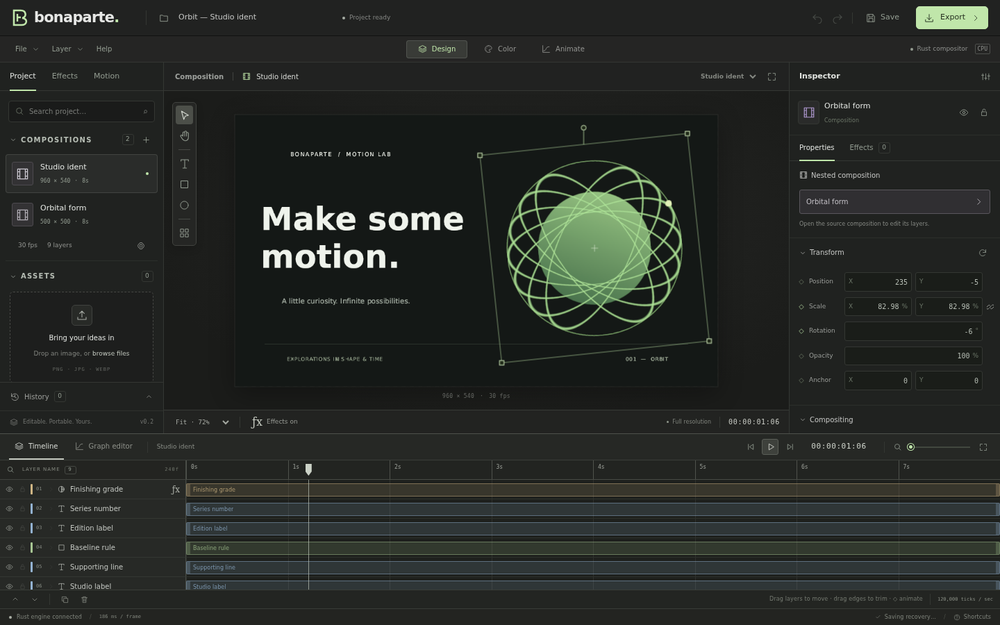

# Bonaparte Studio

**An editable motion-graphics foundation, built with Svelte 5, Tauri 2 and Rust.**

This v0.2 milestone turns the earlier microkernel demonstration into a usable editor: persistent projects, editable content, composition settings, ordered effects, color grading, animation and exports. **It is not an After Effects replacement.** The active compositor is CPU-based; GPU rendering, production video/audio editing, masks and many advanced tools remain future work.



## Run the editor

Prerequisites: current stable **Rust**, **Node.js 20.19+ or 22.12+**, and npm. Install **FFmpeg and ffprobe on PATH** for MP4 export and media tests. PNG export does not require FFmpeg.

### Browser workspace, with the real Rust compositor

From this checkout, or after extracting the foundation source archive:

```sh
cd bonaparte/ui
npm ci
npm run studio
```

These changes are based on [samarnever-droid/bonaparte](https://github.com/samarnever-droid/bonaparte). They are local changes in this deliverable, not a claim that the upstream repository has already been updated.

Open **http://localhost:5173**. `studio` builds and starts the Rust development service on port 4317, then Vite on port 5173. There is **no mock document service or JavaScript compositor**. The browser displays RGBA frames from the same Rust runtime used by Tauri.

For custom ports, set `BONAPARTE_API_PORT` and `VITE_PORT`. The `/api` proxy is same-origin; client code does not call a browser's `localhost` backend. The service binds to `0.0.0.0` for sandbox previews. It is **single-session, development-only, without authentication**: do not expose it to an untrusted network or use it as a multi-user deployment.

### Native desktop

Install the [Tauri 2 platform prerequisites](https://v2.tauri.app/start/prerequisites/), then:

```sh
cd ui
npm ci
npm run tauri dev
```

The native app invokes Rust directly and does not need the HTTP service. Native project/image/video exports use a save dialog and atomic destination replacement. Native build compilation is checked; signed installers, auto-update and cross-platform desktop interaction testing are not part of this milestone. Bundling remains disabled in the Tauri configuration.

## What works

| Area | Implemented in this milestone |
|---|---|
| Projects | New/open/save, versioned portable JSON, embedded image assets, local IndexedDB recovery, invalid-file rejection |
| Compositions | Multiple/nested compositions, editable name, dimensions, background/alpha, rational frame rate and duration |
| Content | Text editing with bundled regular/bold DejaVu Sans, size/tracking/color; rectangle/rounded rectangle and ellipse size/fill/stroke; solids; still-image layers; adjustment layers |
| Canvas | Rust-rendered frame, selection, move/scale/rotate handles, fit/zoom/pan, guides and global effects bypass |
| Timeline | Layer selection/order/visibility/lock/duplicate/delete; trim and move with keyframe retiming; scrubbing, stepping and best-effort playback |
| Animation | Position, scale, rotation, opacity and anchor tracks; keyframe add/remove/move; normalized outgoing Bézier easing editor; four editable motion recipes |
| Effects | Ordered, enabled/disabled, undoable effect instances; manifest-driven controls; scalar/point parameter keyframes |
| Color | 12-control Color Grade, adjustment-layer grading, gradient ramp, sampled 64-bin rendered-frame RGB histogram |
| Output | PNG with alpha; silent H.264 MP4 through FFmpeg; snapshot-based export without blocking document mutations |
| Automation | Stdio MCP project/Op/history/render tools; effect catalog; shared persistence, validation and rendering behavior |

### Color and effect pipeline

**Color Grade:** temperature, tint, exposure, contrast, highlights, shadows, whites, blacks, saturation, vibrance, gamma and fade. Neutral settings are byte-identical; alpha is retained. Exposure and relative white balance operate in linear light; tonal/color controls operate on display-referred RGB. This is **8-bit sRGB**, not HDR, ACES, calibrated Kelvin white balance or a LUT pipeline.

13 first-party packs are registered: **Color Grade, Gradient Ramp, Color Adjust, Tint, Invert, Vignette, Gaussian Blur, Directional Blur, Glow, Drop Shadow, Chromatic Aberration, Transform and Circle**. Circle is a generator; the library shows the 12 filters. Shape content colors are linear model values, converted by the inspector; effect color parameters use display sRGB.

Normal layers render their transformed source into composition space, run the ordered stack, then apply effective opacity and blend. An adjustment layer processes the accumulated backdrop below it and mixes by its opacity; its transform and blend mode do not act as a mask. Blur/glow/shadow are alpha-aware. Spatial effects operate in composition space and clip to the composition bounds.

Plugin metadata and defaults live in manifests. Third-party Rust hosts can register CPU evaluators through the public registry; tests exercise a plugin unknown to the engine. **Dropping a WGSL pack into a folder does not make it executable in this CPU host.** Shader-only execution reports an unsupported-backend error. Bundled WGSL is syntax/type-validated, not GPU-executed; CPU/GPU pixel parity is not claimed.

## Try the workflow

1. Start with the editable **Orbit studio ident**, or **File → New project → Blank project**.
2. Add a text or shape layer; edit its content in **Properties**. Import a PNG/JPEG/WebP through **Project** or drag-and-drop.
3. Add **Color Grade** in the effects library. Use an **Adjustment layer** to grade everything underneath. Switch to **Color** for the histogram; use the viewer's bypass button for comparison.
4. Move the playhead, add inspector diamonds, or apply a **Motion** recipe. Expand a timeline layer to move keys. The graph edits **normalized easing of one outgoing segment**, not an AE-style value/speed graph.
5. **Save** an editable `.bonaparte` file. Recovery is a convenience, not a backup. Use **Export** for a PNG of the current frame or an MP4 of the full active composition.

`Space` plays/pauses; arrows step frames; `Shift`+arrows step ten. `V`/`H` select/hand; `G` guides; `K` keyframe; `1`/`2`/`3` switch workspaces. `Ctrl`/`Cmd`+`S`, `O`, `D`, `Z`, `Shift+Z` save/open/duplicate/undo/redo. **Help** lists shortcuts.

## Limits worth knowing

- CPU full-resolution preview is **not guaranteed real-time**. Playback follows composition time and coalesces render requests; it can skip preview frames. MP4 export renders every scheduled frame.
- Effects currently use **full-frame intermediates**. Effect-bearing tile requests render then crop, not bounded-ROI processing. The old “8 GB / flat RAM / O(tile)” end-to-end promises do not apply.
- Compositions: up to 8192 px per axis, **16,777,216 pixels**, exact-tick frame rates between 1 and 240 fps, duration up to 24 h. These are validation ceilings, not performance guarantees.
- Image import: PNG/JPEG/WebP; source file up to 20 MB, reduced to a 2048 px longest edge for the working asset. Embedded model images are at most 4,194,304 pixels; encoded assets share a 48 MiB document budget. Original full-resolution sources are not separately retained.
- Project files: at most 64 MiB. Version 2 envelopes and legacy raw JSON are readable; unknown versions fail before replacing the session. Older typography/alpha output may differ because rendering has been corrected.
- History: 200 transactions; at most 256 operations in a non-nested Batch. Effect stacks: at most 32 instances per layer. History is session-local, not stored in project files.
- H.264 needs even dimensions. Video is **silent** and transparency is flattened onto black in linear light. Browser MP4 downloads are capped at 128 MiB; native export writes to disk. No export queue/cancel/progress estimate yet.
- No usable video/audio import timeline, masks/mattes, freeform vector paths, expressions, motion blur, tracking, 3D/cameras, advanced text shaping/font selection, LUTs, color wheels/curves or scopes beyond the RGB histogram.

## Architecture and tests

```
Svelte workspace ── Tauri IPC / same-origin HTTP ── runtime
                                                    ├── model: validated Ops + history
MCP tools ───────── shared validation/files/export ──┤
                                                    ├── engine → effects registry
                                                    └── media: FFmpeg process I/O
```

`examples/orbit.bonaparte.json` is ordinary editable project data, not renderer special cases. `crates/runtime` owns the shared editor session and file/render/export services; `crates/preview` is only its development HTTP transport.

```sh
cargo test --workspace --exclude bonaparte-app
cargo check -p bonaparte-app                  # needs native Tauri prerequisites
rustup target add wasm32-unknown-unknown
cargo check -p bonaparte-engine --target wasm32-unknown-unknown
cd ui
npm ci
npm run check                               # Svelte + TypeScript + accessibility diagnostics
npm run build
npx playwright install chromium
npm run test:e2e                             # real Rust, isolated ports 4318 / 5183
```

See [verification](TEST_READY.md), [test infrastructure](TEST_INFRA.md), and [project status / roadmap](PROJECT.md) for measured results and explicitly deferred work. Source and font licensing follow the upstream project and the bundled DejaVu notices in `crates/engine/assets` and `ui/public/fonts`.
