# Bonaparte Studio — Project Tour

*Everything in this document was executed and captured against the live
running product. Screenshots live in `docs/screenshots/`; the demo project
is `examples/night-owl.bonaparte.json`.*

---

## Run it

```bash
cd ui
npm install
npm run studio          # builds the Rust renderer, serves API + UI
# UI  → http://localhost:5183   (API → http://localhost:4318)
```

Headless / sandbox note: the build may be OOM-killed on small machines —
`CARGO_BUILD_JOBS=2 CARGO_PROFILE_DEV_DEBUG=0 npm run studio` is the
low-memory invocation (this is exactly how the verification run below was
served).

---

## The demo: “Night Owl — Studio ident”

`examples/night-owl.bonaparte.json` — 23 vector layers, 8 s @ 30 fps,
960×540, generated by `examples/make_night_owl.py` (regenerate any time).
Open it with **File → Open** or push it over the bridge:

```bash
curl -s localhost:4318/api/open_project -H "X-Bonaparte-Client: editor" \
  -d "{\"json\": $(python3 -c 'import json;print(json.dumps(open("examples/night-owl.bonaparte.json").read()))')}"
```

What’s animated (pure keyframes — every part is an editable
`LayerKind::Shape { points }` vector):

| Part | Motion |
|------|--------|
| Body | breathe (scale) + slow sway (rotation); **every other owl part is parented to it** |
| Wings | flap ±24° every 1.5 s around shoulder anchors |
| Eyes | pupils dart (Hold easing), double-blink via Y-squash at 2.4 s & 5.1 s |
| Stars | 6 stars twinkle on staggered phase |
| Moon | slow breathing scale |
| HOOT ring | stroke ring pops from the beak at 6.4 s |

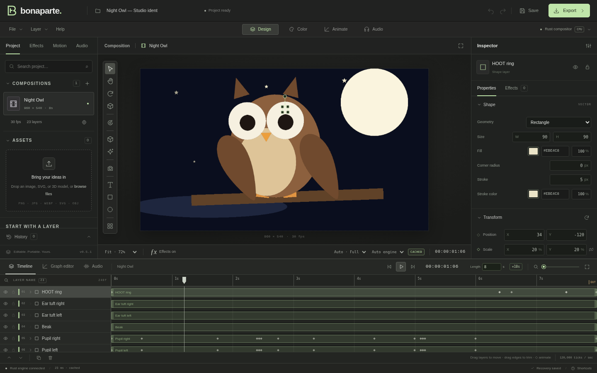

### Frames from the running product

| | |
|---|---|
| 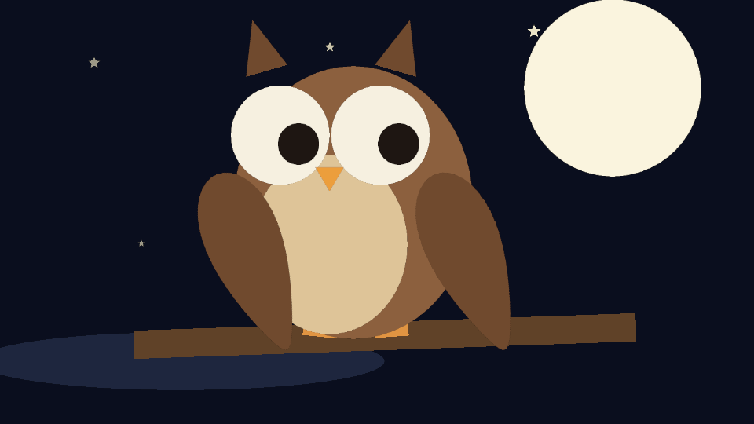 | 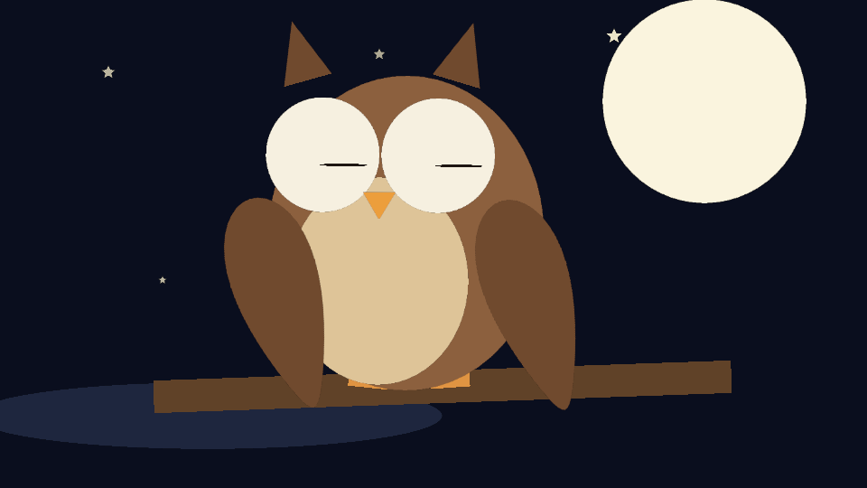 |
| 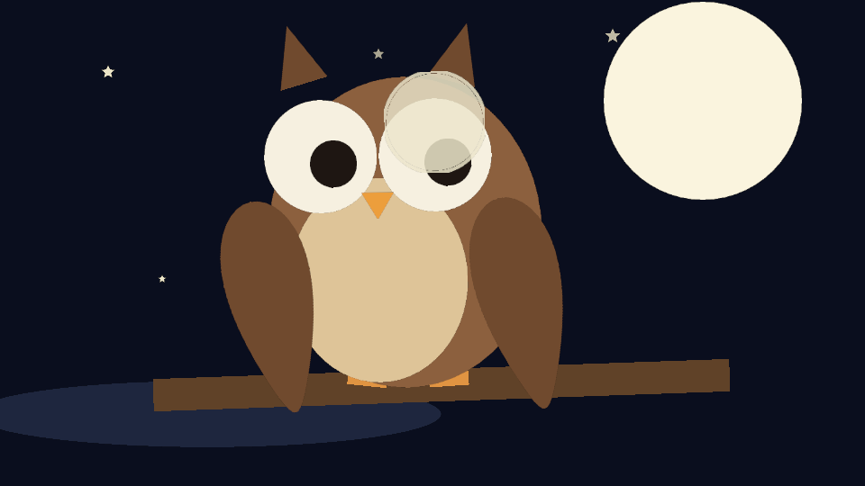 | 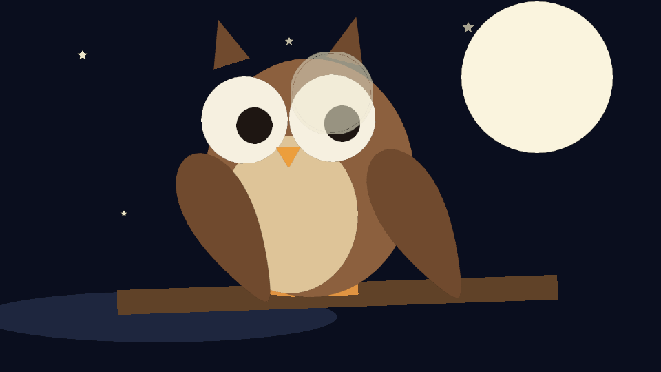 |

---

## The tour

**Composition** — the viewport renders through the Rust engine; the frame
right of the owl is the timeline with per-layer keyframe diamonds
(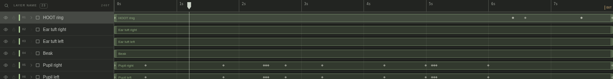), the pure render is
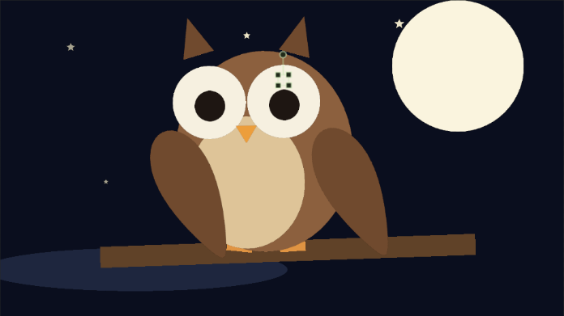.

**Sidebar** — compositions, assets, and the import zone that accepts
**PNG · JPG · WEBP · SVG · OBJ** plus audio
(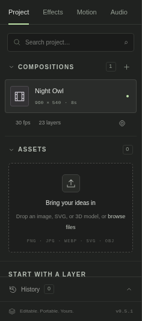).

**Properties** — select any layer: numeric transform fields, and for vector
shapes a live **Geometry/Fill/Stroke** section (the owl’s parts are all
editable vectors — 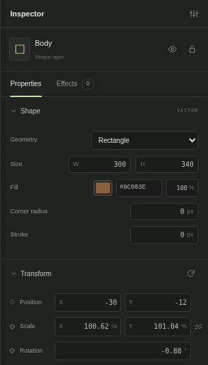).

**Effects** — `builtin.glow` applied to the Body through one bridge op,
inspected in the Effects tab
(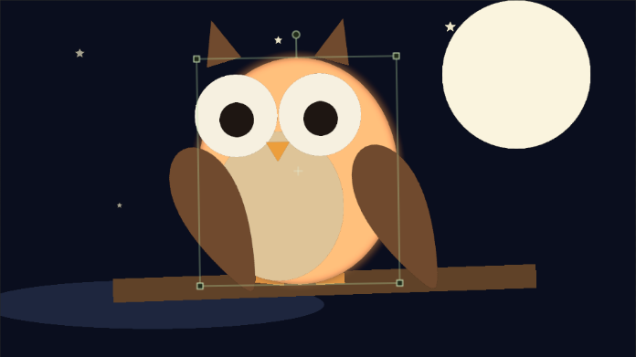, panel:
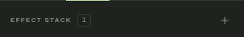).

**Context menus** — right-click a timeline layer (Duplicate/Rename/Lock/
**Vectorize to shapes**/reorder/…):
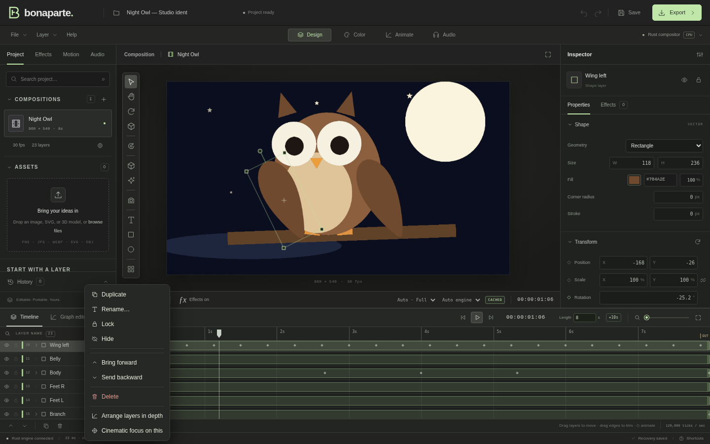 — right-click the
canvas for quick layer creation:
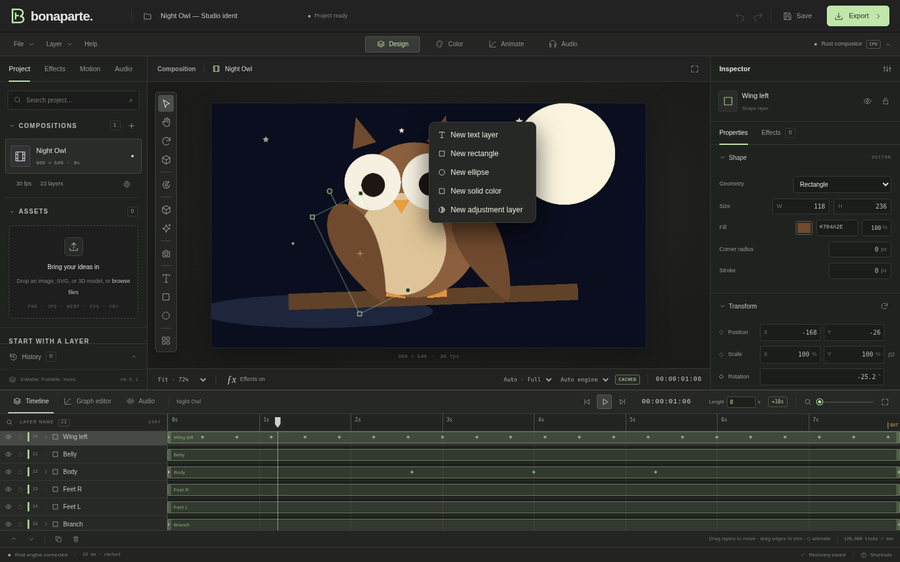.

**Export with the runner game** — the dialog shows real facts about the job
(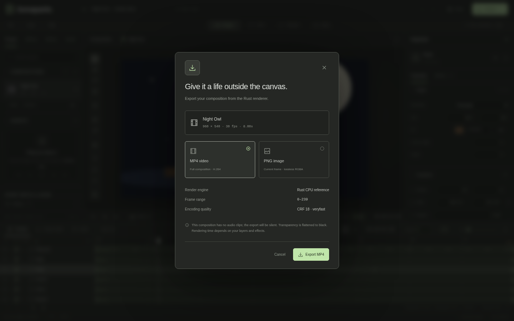); MP4 export renders on
every CPU core in parallel and the dialog becomes a live instrument:
percent, frames done/total, **measured fps**, **smoothed ETA**, elapsed,
and a Cancel button — with a tiny runner sprinting the bar: legs pump with
fps, sunglasses at high fps, a star pops every 10 %, confetti at 100 %
(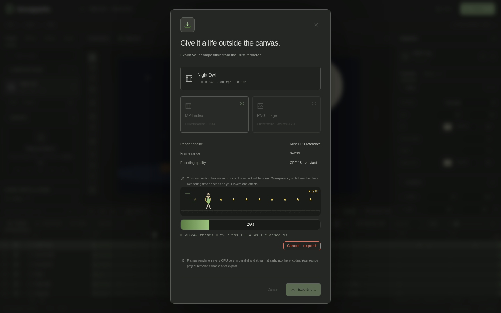).

**3D killer features** — one click builds a spinning card diorama with
camera + DoF (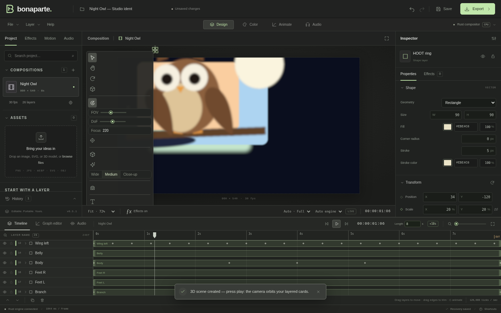); the
arrangements menu applies Diorama / Parallax / Carousel / Corridor in one
undoable batch (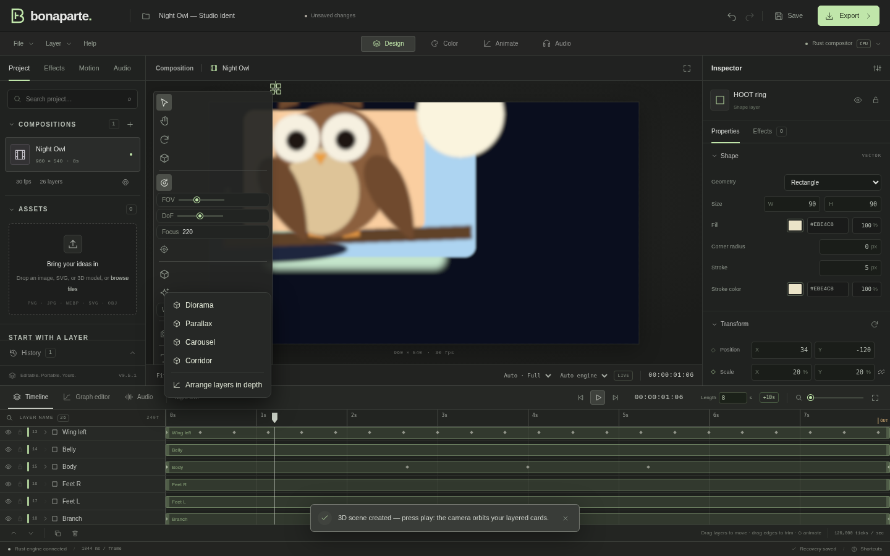);
framing presets Wide / Medium / Close-up drive the camera
(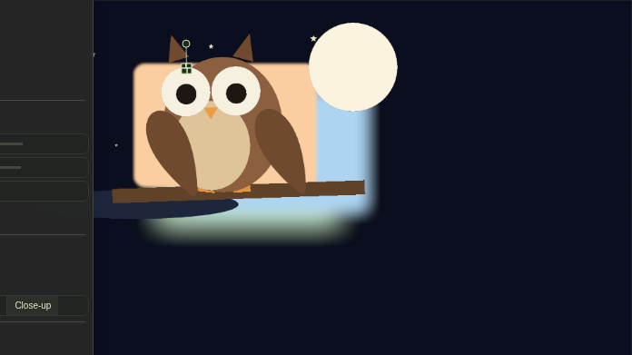).

**Imports** — an SVG dropped on the import zone lands as editable vector
shape layers, selected and ready ().

**History & example** — every op above is one undo step
(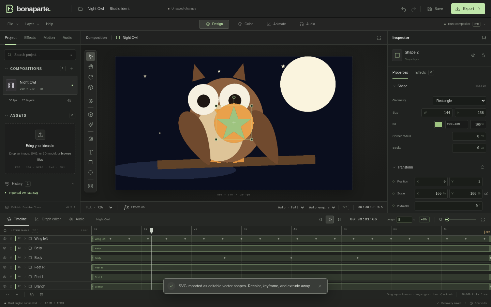); the bundled example
project still loads (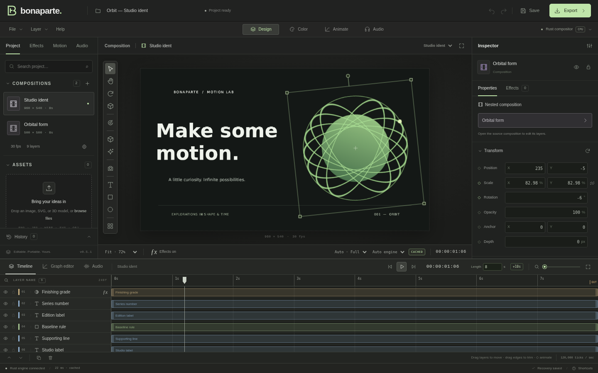).

---

## Bug found & fixed during this tour

The first owl render showed **horizontal stripes through every filled
shape** (rows of half-alpha where polygon vertices crossed the sample
grid). Root cause: the optimized vector rasterizer advanced its
active-edge table per *subsample* (y+0.25, y+0.75) while samples restart
at +0.25 in every pixel — an edge whose span began between the two sample
rows went missing for the rest of the row. Fix: manage the table once per
row against the full 2×2 span
(`crates/engine/src/vector.rs`), with a vertex-aligned regression test
(`crates/engine/tests/probe.rs`). All 314 Rust tests + 76 browser tests
green after the fix.

Also hardened during the tour: the export ETA now ignores stale telemetry
left in the process-global slot by a *previous* export and waits out the
pipeline warm-up before trusting early fps samples
(`ui/src/lib/store.svelte.ts`).

## Verification (this exact tree)

- `cargo fmt --all --check` — clean
- `cargo test --workspace --exclude bonaparte-app` — **314 passed, 0 failed**
- `cargo check -p bonaparte-runtime --no-default-features --target wasm32-unknown-unknown` — clean
- `svelte-check --threshold error` — 0 errors, 0 warnings
- `playwright test` — **76 passed** (fresh server; a long-lived shared
  server can flake the AudioWorklet spec’s context-state poll)
- Live server + all screenshots above produced from it
